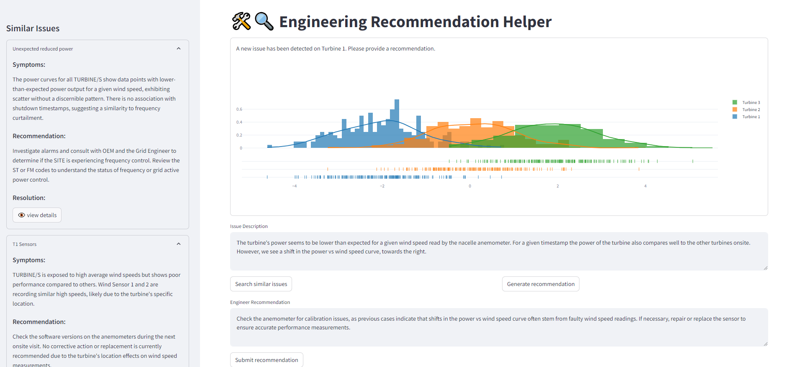

# Engineering Recommendation Helper

A RAG system that uses vector search to show users similar engineering issues that have
occurred in the past and uses these as context to suggest how to solve a new issue.

A streamlit UI is used to interact with the search engine.

This was part of the submission for the [2024 Databricks Generative AI World Cup](https://hackathon.stackup.dev/web/events/generative-ai-world-cup-2024-so-you-think-you-can-hack), which resulted in our team winning the 3rd place in the EMEA region.

The team consisted of [Gabriele Calvo](https://www.linkedin.com/in/calvogabriele/), [Lewis Harvey](https://uk.linkedin.com/in/lewis-harvey-786b8b177), [Abbie Rhodes](https://uk.linkedin.com/in/abbie-r-467017200) and [Yousif Kilano](https://uk.linkedin.com/in/yousif-kilano-048686145)

## Basic Architecture


## Example Usage



## Local Development

Make sure you have a profile setup for the `.databrickscfg` file in your user home directory:

```
[dev-eng-rec-helper]
host      = https://#####.cloud.databricks.com
auth_type = databricks-cli
serverless_compute_id = auto
```

to run the all linting and testing for all subprojects use: `uvx invoke cleanup`

## Deploy processing
To deploy the processing jobs in the dev environment use:
```bash
uvx invoke deploy-processing
```

For the data processing, we are using [asset bundles](https://learn.microsoft.com/en-us/azure/databricks/dev-tools/bundles/).
To trigger the run of processing jobs in the dev environment use:
```bash
databricks bundle run -t dev summarization
databricks bundle run -t dev vector-index-creation
```

For the web app we are using databricks app and pyinvoke:
```bash
uvx invoke deploy-webapp
```
