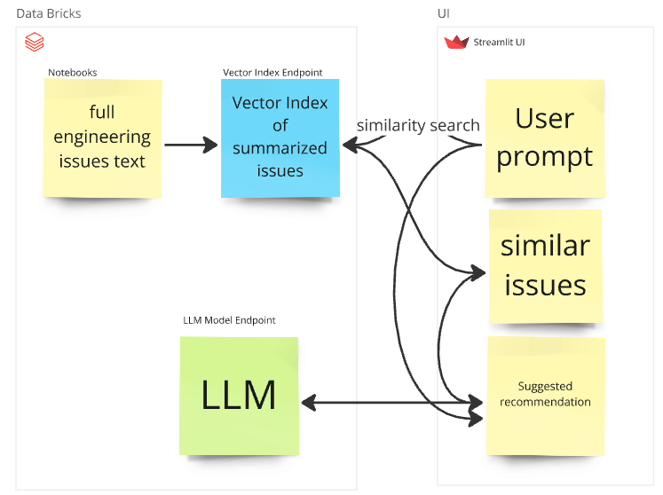
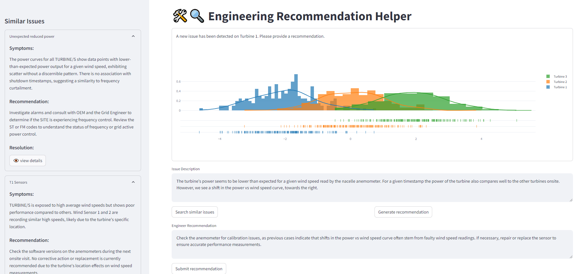

# Engineering Recommendation Search
A RAG system that uses vector search to show users similar engineering issues that have 
occurred in the past and uses these as context to suggest how to solve a new issue. 

A streamlit UI is used to interact with the search engine.


## Basic Architecture



## Example Usage



## Run the dashboard locally
```sh
uv run streamlit run ./src/main.py
```


## Development
Set up venv using UV:
```bash
uv sync
```


Run pre-commit checks using poethepoet commands:
```bash
uv run poe all
```
